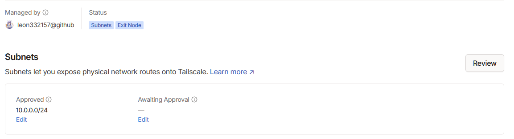

+++
title = "My first time experience with Tailscale VPN"
summary = "My motivation to try Tailscale and how it improves my workflow"
+++

## My previous VPN infrastructure

Previously, I ran OpenVPN on my home router, as well as Wireguard on my home server, however, although that worked well for my need, which is to simply connect to my home, it was slow due to the limitation of my home internet bandwidth.

## My motivation

My previous setup used a "star" model where all of my clients connect to my home network, thus sharing the same LAN to communicate. My home server acts as the relay to send packets to the devices. However, I understand that Wireguard, in addition to traditional "star" topology for VPN, I can also configure it to use p2p connection by adding peers. This is so called "Mesh" VPN service. Mesh VPN is better for my specific use case to bypass the need to connect to my home network.
I want a piece of mesh VPN software that is easy to deploy and fast, as well as secure like Wireguard. I have narrowed down to 2 candidates: Tailscale and Netbird.

### How Tailscale and Netbird architecture works

- On a high level, these software have a central coordination server to facilitate p2p connection between clients
- When direct connection is not possible, a relay service can be used to forward encrypted traffic between clients

### Comparing Tailscale to Netbird

- These two pieces of software are very similar, they provide a managed mesh VPN based on Wireguard
- Tailscale has opensourced their "core" technology, however, their coordination server as well as clients are closed source. There is a third party server called "headscale" which allows for self-hosted service should I choose to use it
- Netbird on the other end is fully open source, including their clients and servers. This is great, however, Netbird is relatively newer and is in development, I have observed bugs while trying out Netbird.

### My setup for Tailscale

- Setting up tailscale is extremely simple on my devices, including golang based Linux clients, IOS as well as Windows.
- All my devices have MagicDNS names based on their hostname, so ssh'ing is as simple as typing in "ssh aspire"
- I also added a subnet router to route traffic to my home network to achieve the same effect as my previous setup.

