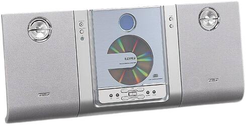
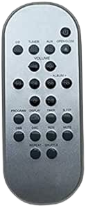

## Introduction

During one of my scavenger hunt on the UMass campus, I acquired and repaired a Micro HiFi system from Philips, the MC 235-37 model.

It does not come with speakers or remote, I happen to also have speakers, and that solves the issue of sound, but how do I control it when there's only a few buttons?

Now the remote may look something like this, as you can see it has a few more buttons for some other functionalities.

I thought about buying a remote, but I decided to make it fun, why don't I just make my own with a mcu that includes wifi? First thing that came to my mind was the ESP32. After some googling I discoverd this library [IRRemoteESP8266](https://github.com/crankyoldgit/IRremoteESP8266), however I had issues with a ESP32, I decided to switch to an bigger ESP8266 board, which is the target of the library. 

GitHub Link [https://github.com/leon332157/MC235-IRremote](https://github.com/leon332157/MC235-IRremote)

More write up is WIP