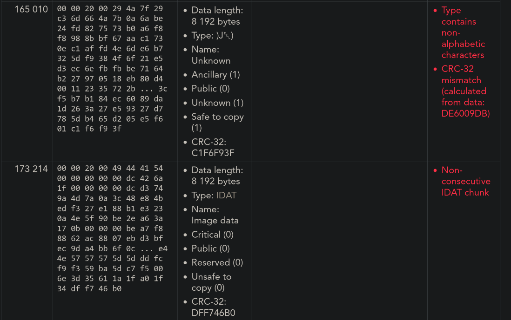

#### Full cleared Minuteman CTF 2025!

One challenge I liked is `chunked`, it is a hard forensics challenge.

Description: Bloo keeps corrupting my files! I managed to save bits of a really nice photo I took... but it's all messed up. Can you recover the original image?


unzipping the artifact yielded 4 corrupted png images. inclusion of corrupted image is intended


#### If you can't see the image, you can download the zip file [here](chall.zip)

As you can see in the second image, you can see the starting part of the flag. So initially I started using online repairing of png images, which all yielded no results. Was confused and scratching my head.

Then I stumbled upon this tool called [pngcheck](https://wiki.bi0s.in/steganography/pngcheck/) when searching for "how to check png for errors" which allowed me to check the images.

running `pngcheck` on each sample shows these results:

```
pngcheck part0.png 
part0.png:  invalid chunk name "ԥE" (ffffffd4 ffffffa5 45 11)
ERROR: part0.png
part1.png:  invalid chunk name ")J)" (29 4a 7f 29)
ERROR: part1.png
part2.png:  invalid chunk name "a��" (61 ffffffb8 16 ffffffc6)
ERROR: part2.png
part3.png:  invalid chunk name "" (00 ffffffe6 ffffffd4 19)
ERROR: part3.png
```

As we can see here, `pngcheck` showed errors on certain chunks of png.

### What the heck is a chunk and why is it corrupted?

After some research, and reading [this article](https://medium.com/@0xwan/png-structure-for-beginner-8363ce2a9f73) I can understand the PNG format uses chunks (this is how your images can show up partially in webpages), and that corruption in one chunk can render the image un-showable.

Essentially, on a file level, png may look something like this:

```txt
MAGIC (used to identify as PNG 89 50 4E 47 0D 0A 1A 0A) 
IHDR (critical header chunk, contains information such as dimension/)
PLTE (critical color palette chunk)
IDAT (actual image pixel data, must be consecutive and end with IEND)
IEND
```

While each chunk looks like this:

```txt
4 byte length of it's data
4 byte chunk type (ASCII)
*actual data*
4 byte of CRC (calculated on all preceding data)
```

It is important to keep in mind that each chunk has a CRC, this can be used to check if itself is corrupted.

Sample hexdump:
```
00000000  89 50 4e 47 0d 0a 1a 0a  00 00 00 0d 49 48 44 52  |.PNG........IHDR|
00000010  00 00 0f e7 00 00 09 2f  08 02 00 00 00 91 4d fb  |......./......M.|
00000020  bb 00 00 00 09 70 48 59  73 00 00 0e c4 00 00 0e  |.....pHYs.......|
```

### What's wrong with the images?

With this information, I started looking online on how to verify PNG chunks. I discovered the [PNG File chunk inspector](https://www.nayuki.io/page/png-file-chunk-inspector) online tool. With this tool, you can see very detailed information about each chunk of a PNG file, including which chunk is corrupted. I uploaded all the images, you can see a sample here.

part0.png


part1.png:


You can see that the tool detects chunk 165 010 as corrupted for `part1.png`, while the same chunk appears to be normal in `part0.png`.

### How do I recover them?

I suspected that all of these pngs are essentially the same file but with different chunks corrupted. Which I then verified the hypophysis by uploading all the samples into the chunk verifier. Which I will not show here. This proved my hypophysis correct.


In order to recover the image, I just have to replace all the corrupted chunks with a known-good chunk. I could do this manually, but there were too many, so I needed to write a script.

### Writing a PNG parser

I stumbled upon this blog-post while researching how to write a png parser. [Writing a (simple) PNG decoder might be easier than you think](https://pyokagan.name/blog/2019-10-14-png/)

Look simple, let's borrow and modify this code to parse our images :3

I wrote a read-chunk function like so:

```py
def read_chunk(f):
    header = f.read(8)
    if len(header) < 8:
        return (False, b"IEND", b"")  # if the image have corrupted IEND chunk, add one
    
    chunk_length, chunk_type = struct.unpack(">I4s", header)
    if chunk_type not in [
        b"IHDR",
        b"IDAT",
        b"IEND",
        b"pHYs",
        b"iTXt",
    ]:  # we don't care about other non-critical chunks
        f.seek(chunk_length + 4, 1)  # skip chunk data + crc
        return (False, chunk_type, b"")
    
    print("Reading chunk:", chunk_type, "length", chunk_length)
    chunk_data = f.read(chunk_length)
    chunk_expected_crc = struct.unpack(">I", f.read(4))
    chunk_actual_crc = zlib.crc32(
        chunk_data, zlib.crc32(struct.pack(">4s", chunk_type))
    )
    if chunk_expected_crc != chunk_actual_crc:
        print("chunk checksum failed")
    return (chunk_expected_crc == chunk_actual_crc, chunk_type, chunk_data)
```

The function takes in a image file, then returns a tuple that contains validity of the chunk, it's type and data on each call.

Using this function, we are read in all of the chunks of the corrupted parts. PS: I know this can be looped but I can't be bothered.

```py
part0_chunks = []
part1_chunks = []
part2_chunks = []
part3_chunks = []
while True:
    part0_chunks.append(read_chunk(p0))
    if part0_chunks[-1][1] == b"IEND":
        break
while True:
    part1_chunks.append(read_chunk(p1))
    if part1_chunks[-1][1] == b"IEND":
        break
while True:
    part2_chunks.append(read_chunk(p2))
    if part2_chunks[-1][1] == b"IEND":
        break
while True:
    part3_chunks.append(read_chunk(p3))
    if part3_chunks[-1][1] == b"IEND":
        break
```

Now with all of the chunks read-in, we can select one as the basis of our recovery image, iterate over all the chunks, then replace it with a good copy if it's corrupted (invalid crc).

```py
recon = part2_chunks[:]
for i in range(len(recon)):
    # check if the chunk is valid
    valid = recon[i][0]
    if valid:
        continue
    # else search for the next valid chunk to replace it
    if part0_chunks[i][0]:
        recon[i] = part0_chunks[i]
    elif part1_chunks[i][0]:
        recon[i] = part1_chunks[i]
    elif part3_chunks[i][0]:
        recon[i] = part3_chunks[i]
    else:
        print("error, cant find replacement on", i)
        break
```

At last, we write all the chunks of the recovered image out:

```py
with open("reconstructed.png", "wb") as out:
    out.write(magic)
    for valid, chunk_type, chunk_data in recon:
        if not valid:
            print("warning, writing invalid chunk", chunk_type)
        out.write(struct.pack(">I4s", len(chunk_data), chunk_type))
        out.write(chunk_data)
        chunk_crc = zlib.crc32(chunk_data, zlib.crc32(struct.pack(">4s", chunk_type)))
        out.write(struct.pack(">I", chunk_crc))
```

We get our beautiful re-constructed image with the full flag.


<br>

#### Funny moment

I had very bad skill issue reading the font, confusing "1" with "I", had a crashout :(. Thanks to my friend Shanzay who has better reading skill.


Thanks for reading!

Full Solve:
```py
import zlib
import struct

p0 = open("part0.png", "rb")
p1 = open("part1.png", "rb")
p2 = open("part2.png", "rb")
p3 = open("part3.png", "rb")

parts = [p0, p1, p2, p3]
chunk_reconstruct = []

magic = b"\x89PNG\r\n\x1a\n"
for p in parts:
    if p.read(len(magic)) != magic:
        raise Exception("Invalid PNG Signature in part")


def read_chunk(f):
    header = f.read(8)
    if len(header) < 8:
        return (False, b"IEND", b"")  # if the image have corrupted IEND chunk, add one
    
    chunk_length, chunk_type = struct.unpack(">I4s", header)
    if chunk_type not in [
        b"IHDR",
        b"IDAT",
        b"IEND",
        b"pHYs",
        b"iTXt",
    ]:  # we don't care about other non-critical chunks
        f.seek(chunk_length + 4, 1)  # skip chunk data + crc
        return (False, chunk_type, b"")
    
    print("Reading chunk:", chunk_type, "length", chunk_length)
    chunk_data = f.read(chunk_length)
    chunk_expected_crc = struct.unpack(">I", f.read(4))
    chunk_actual_crc = zlib.crc32(
        chunk_data, zlib.crc32(struct.pack(">4s", chunk_type))
    )
    if chunk_expected_crc != chunk_actual_crc:
        print("chunk checksum failed")
    return (chunk_expected_crc == chunk_actual_crc, chunk_type, chunk_data)


part0_chunks = []
part1_chunks = []
part2_chunks = []
part3_chunks = []
while True:
    part0_chunks.append(read_chunk(p0))
    if part0_chunks[-1][1] == b"IEND":
        break
while True:
    part1_chunks.append(read_chunk(p1))
    if part1_chunks[-1][1] == b"IEND":
        break
while True:
    part2_chunks.append(read_chunk(p2))
    if part2_chunks[-1][1] == b"IEND":
        break
while True:
    part3_chunks.append(read_chunk(p3))
    if part3_chunks[-1][1] == b"IEND":
        break
print(len(part0_chunks), "chunks in part0")
print(len(part1_chunks), "chunks in part1")
print(len(part2_chunks), "chunks in part2")
print(len(part3_chunks), "chunks in part3")
recon = part2_chunks[:]
for i in range(len(recon)):
    # check if the chunk is valid
    valid = recon[i][0]
    if valid:
        continue
    # else search for the next valid chunk to replace it
    # print(part1_chunks[i])
    # print(part1_chunks[i])
    # print(part2_chunks[i])
    # print(part3_chunks[i])
    if part0_chunks[i][0]:
        recon[i] = part0_chunks[i]
    elif part1_chunks[i][0]:
        recon[i] = part1_chunks[i]
    elif part3_chunks[i][0]:
        recon[i] = part3_chunks[i]
    else:
        print("error, cant find replacement on", i)
        break
with open("reconstructed1.png", "wb") as out:
    out.write(magic)
    for valid, chunk_type, chunk_data in recon:
        if not valid:
            print("warning, writing invalid chunk", chunk_type)
        out.write(struct.pack(">I4s", len(chunk_data), chunk_type))
        out.write(chunk_data)
        chunk_crc = zlib.crc32(chunk_data, zlib.crc32(struct.pack(">4s", chunk_type)))
        out.write(struct.pack(">I", chunk_crc))
```