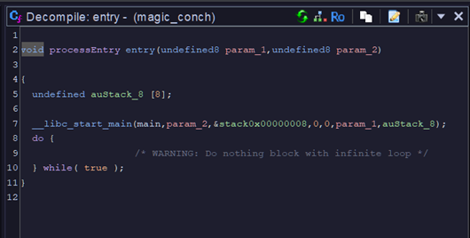
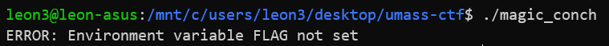
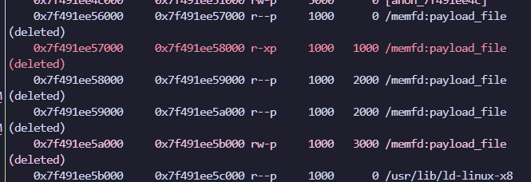
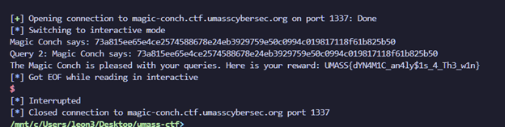

Magic Conch is a rev challange.

Downloading and opening the binary file in Ghidra:



We can find an entry point, I have renamed the main function to `main`.

Here is the main function in Ghidra, edited for clarity:

```c
int main(void)

{
  char buf [64];
  uint outlen;
  int length;
  code *entry_point_function;
  void *shared_obj_ptr;
  int memfd;
  void *dec_data;
  void *input_data;
  
  input_data = (void *)gen1(&enc_bin_start,&length);
  if (input_data == NULL) {
    exit(1);
  }
  dec_data = (void *)gen2(input_data,length,&outlen);
  if (dec_data == NULL) {
    exit(1);
  }
  free(input_data);
  memfd = memfd_create("payload_file",0);
  if (memfd == 0) {
    exit(1);
  }
  write(memfd,dec_data,outlen);
  sprintf(buf,"/proc/self/fd/%d",(ulong)(uint)memfd);
  shared_obj_ptr = (void *)dlopen(buf,1);
  if (shared_obj_ptr == NULL) {
    free(input_data);
    exit(1);
  }
  entry_point_function = (code *)dlsym(shared_obj_ptr,"EntryPoint");
  if (entry_point_function == NULL) {
    free(input_data);
    dlclose(shared_obj_ptr);
    exit(1);
  }
  (*entry_point_function)();
  dlclose(shared_obj_ptr);
  close(memfd);
  free(dec_data);
  return 0;
}
```

Looking at the main function, we can see that it uses syscalls such as `dlopen` as well as `dlsym`. These functions are used to load dynamic libraries and get the address of a function. In addition, we also see a memfd_create function call.

Looking a the man page of this function:

>**memfd_create()** creates an anonymous file and returns a file descriptor that refers to it.  The file behaves like a regular file, and so can be modified, truncated, memory-mapped, and so on.  However, unlike a regular file, it lives  in  RAM and has a volatile backing storage.

In othe words, this function creates a large region in memory so that we can treat it as a regular file. This is important because we need to use this chunk of memory to load the dynamic object, and is important later on.

For now, Let's first look at `gen1` function, which takes in a pointer to a symbol I called `enc_bin_start`, this points to a large chunk of data in the .data section of the ELF. Then it takes in another pointer, which appears to be a integer.

```c
void *gen1(char *param_1,uint *param_2)

{
  int iVar1;
  int iVar2;
  size_t len;
  void *__ptr;
  long local_18;
  ulong local_10;
  
  len = strlen(param_1);
  if ((len & 1) == 0) {
    *param_2 = (uint)(len >> 1);
    __ptr = malloc((ulong)*param_2);
    if (__ptr == (void *)0x0) {
      __ptr = (void *)0x0;
    }
    else {
      local_18 = 0;
      for (local_10 = 0; local_10 < len; local_10 = local_10 + 2) {
        iVar1 = FUN_001013c9((int)param_1[local_10]);
        iVar2 = FUN_001013c9((int)param_1[local_10 + 1]);
        if ((iVar1 == -1) || (iVar2 == -1)) {
          free(__ptr);
          return (void *)0x0;
        }
        *(byte *)(local_18 + (long)__ptr) = (byte)(iVar1 << 4) | (byte)iVar2;
        local_18 = local_18 + 1;
      }
    }
  }
  else {
    __ptr = (void *)0x0;
  }
  return __ptr;
}
```

I'm not sure what this function does, but it perhaps calculates the length of the encrypted data, moving on to `gen2` function.

```c
char *gen2(char *in,int inlen,int *outlen)

{
  int temp;
  char *output;
  EVP_CIPHER_CTX *ctx;
  EVP_CIPHER *cbc_mode;
  
  output = (char *)malloc(100000);
  if (output == NULL){
    free(NULL);
    output = NULL;
  }
  else {
    ctx = EVP_CIPHER_CTX_new();
    if (ctx == NULL) {
      free(output);
      output = NULL;
    }
    else {
      xorcpy(&buf1,"C++ IS GARBAGE!!",0x10);
      xorcpy(&buf2,"C++ IS GARBAGE!!",0x10);
      cbc_mode = EVP_aes_128_cbc();
      temp = EVP_DecryptInit_ex2(ctx,cbc_mode,&buf1,&buf2,0);
      if (temp == 0) {
        free(output);
        EVP_CIPHER_CTX_free(ctx);
        output = NULL;
      }
      else {
        temp = EVP_DecryptUpdate(ctx,output,outlen,in,inlen);
        if (temp == 0) {
          free(output);
          EVP_CIPHER_CTX_free(ctx);
          output = NULL;
        }
        else {
          EVP_CIPHER_CTX_free(ctx);
        }
      }
    }
  }
  return output;
}
```

This function seems to contain OpenSSL symbols, see [here](https://www.openssl.org/docs/man3.0/man3/EVP_DecryptInit_ex.html).
It also contains the key and the iv used to decrypt. The key and iv are in `buf1` and `buf2` respectively according to the documentation. Using these clues, I can infer that this function decrypts the big chunk of data pointed from `gen1`.

Knowing this, I initially wanted to dump this data chunk and use Python to decrypt the data, however, later on that was proven a bad idea.
I spent about an hour trying to find a Python library to decrypt, however, I failed miserably.

As I was struggling to solve the challange, I remembered the `memfd_create` call and quickly wrote a pwntools script to check the memory of the running binary.

```py3
from pwn import *
e = context.binary = ELF("./magic_conch")
context.terminal = ["tmux", "splitw", "-h"]

p = gdb.debug(
    context.binary.path,
    env={"FLAG": "FLAG{WIN}", "PORT": "9090"},
    gdbscript="""
              continue
              brva 0x15d5 # write call
              brva 0x1676 # executing the loaded code
             """,
)
p.interactive()
```


I needed to add the environment variables because without them the binary throws an error. The breakpoints from `brva` are used because of PIE and they set breakpoints in virtual addresses, in other words offset from binary base.

When I break at the first breakpoint, I call `vmmap` in pwndbg.



There is a memory region named "payload_file", observing the structure of the main function, we can infer that this file is the decrypted object file to be loaded. Using the `dump memory` gdb command, I was able to dump this object file and open it in Ghidra.

### Here comes the real deal

Looking at the dumped object file directly in Ghidra, it's not immediately obvious what function is being ran, however, talking a closer look, I named this function main:

```c
void main(void)

{
  int iVar1;
  pthread_t local_50;
  sockaddr soaddr1;
  int local_30;
  socklen_t local_2c;
  sockaddr soaddr;
  int local_14;
  char *local_10;
  
  _FLAG = getenv("FLAG");
  if (_FLAG == (char *)0x0) {
    puts("ERROR: Environment variable FLAG not set");
                    /* WARNING: Subroutine does not return */
    exit(1);
  }
  local_10 = getenv("PORT");
  if (local_10 == (char *)0x0) {
    puts("ERROR: Environment variable PORT not set");
                    /* WARNING: Subroutine does not return */
    exit(1);
  }
  _PORT = atoi(local_10);
  local_2c = 0x10;
  local_14 = socket(2,1,0);
  if (local_14 < 0) {
                    /* WARNING: Subroutine does not return */
    exit(1);
  }
  soaddr.sa_family = 2;
  soaddr.sa_data[2] = '\0';
  soaddr.sa_data[3] = '\0';
  soaddr.sa_data[4] = '\0';
  soaddr.sa_data[5] = '\0';
  soaddr.sa_data._0_2_ = htons((uint16_t)_PORT);
  iVar1 = bind(local_14,&soaddr,0x10);
  if (iVar1 < 0) {
                    /* WARNING: Subroutine does not return */
    exit(1);
  }
  iVar1 = listen(local_14,10);
  if (iVar1 < 0) {
                    /* WARNING: Subroutine does not return */
    exit(1);
  }
  printf("Listening on port %d...\n",(ulong)_PORT);
  while( true ) {
    local_30 = accept(local_14,&soaddr1,&local_2c);
    if (local_30 < 0) break;
    pthread_create(&local_50,(pthread_attr_t *)0x0,(__start_routine *)0x0,&local_30);
  }
  exit(1);
}
```

I can infer that this function is executed as the entry point, recall earlier that it wanted to access environment variables?

However this function isn't what we are coming for, next up is the function I called `magic_conch`:

<details>

<summary> Click to expand full code </summary>

```c
void magic_conch(int *sockfd) {
  int res;
  size_t len;
  void *hash1;
  void *hash2;
  char flagbuf [128];
  char buf1 [256];
  char sendbuf1 [256];
  char printbuf1 [65];
  char printbuf [65];
  char recvbuf1 [33];
  char recvbuf [33];
  int fd;
  
  memset(recvbuf,0,33);
  memset(recvbuf1,0,33);
  memset(printbuf,0,65);
  memset(printbuf1,0,65);
  memset(sendbuf1,0,256);
  memset(buf1,0,256);
  fd = *sockfd;
  len = strlen(welcome);
  send(fd,welcome,len,0);
  send(fd,"Query 1: ",9,0);
  recv(fd,recvbuf,33,0);
  hash1 = HASH(recvbuf);
  if (hash1 == NULL) {
    len = strlen(errmsg);
    send(fd,errmsg,len,0);
  }
  else {
    hash_fmt(hash1,printbuf);
    sprintf(sendbuf1,"Magic Conch says: %s\n",printbuf);
    len = strlen(sendbuf1);
    send(fd,sendbuf1,len,0);
    send(fd,"Query 2: ",9,0);
    recv(fd,recvbuf1,33,0);
    hash2 = HASH(recvbuf1);
    if (hash2 == 0) {
      len = strlen(errmsg);
      send(fd,errmsg,len,0);
      free(hash1);
    }
    else {
      hash_fmt(hash2,printbuf1);
      sprintf(buf1,"Magic Conch says: %s\n",printbuf1);
      len = strlen(buf1);
      send(fd,buf1,len,0);
      res = memcmp(recvbuf,recvbuf1,0x20);
      if (res == 0) {
        len = strlen(repeat);
        send(fd,repeat,len,0);
      }
      else {
        res = memcmp(hash1,hash2,0x20);
        if (res == 0) {
          flagbuf[0] = '\0';
          ...
          flagbuf[127] = '\0';
          sprintf(flagbuf,"The Magic Conch is pleased with your queries. Here is your reward: %s\n" ,
                  _FLAG);
          len = strlen(flagbuf);
          send(fd,flagbuf,len,0);
        }
        else {
          len = strlen(fail);
          send(fd,fail,len,0);
        }
      }
      free(hash1);
      free(hash2);
    }
  }
  close(fd);
  pthread_exit(0);
}
```

</details>
<br>

This is a large function, let's remove some code and break it down further:

```c
void magic_conch(int *sockfd) {
    send(socket,"Query 1: ",9,0);
    recv(fd,recvbuf,33,0); // recv query 1
    hash1 = HASH(recvbuf);
    hash_fmt(hash1,printbuf);
    sprintf(sendbuf1,"Magic Conch says: %s\n",printbuf);
    send(fd,sendbuf1,len,0);
    send(fd,"Query 2: ",9,0);
    recv(fd,recvbuf1,33,0); // recv query 2
    hash2 = HASH(recvbuf1);
    hash_fmt(hash2,printbuf1);
    sprintf(buf1,"Magic Conch says: %s\n",printbuf1);
    res = memcmp(recvbuf,recvbuf1,32); 
    if (res == 0) { // if the two queries are the same
        send(fd,repeat,len,0); // Magic Conch does not like repeat queries
    }
    else {
        res = memcmp(hash1,hash2,32); // the two hashes must be the same
        if (res == 0) {
          sprintf(flagbuf,"The Magic Conch is pleased with your queries. Here is your reward: %s\n" ,
                  _FLAG);
          len = strlen(flagbuf);
          send(fd,flagbuf,len,0);
        }
    }
}
```

We can see that in order for us to get the flag, we must have a hash collison from the `HASH` function, with two different queries. So, let's look at the `HASH` function

```c

char * HASH(char *input)

{
  char result [32];
  char *str2;
  char *unused1;
  char *str1;
  char *unused2;
  char *outbuf;
  
  memset(&str1,0,16);
  memset(&str2,0,16);
  memset(result,0,32);
  unused2 = input + 8
  str1 = input;
  unused1 = input + 24
  str2 = input + 16
  strxor(&str1,&str2,result,16);
  outbuf = (char *)malloc(32);
  SHA256(result,32,outbuf);
  return outbuf;
}
```

We can see that it uses a SHA256 hash, that is unbreakable. However, we do see that it calls a function I named `strxor`, let's look at that.

```c
void strxor(char *str1, char *str2, char *res, int limit) {
  int i;
  
  for (i = 0; i < limit; i = i + 1) {
    res[i] = str1[i] ^ str2[i];
  }
  return;
}
```

Looks like this function takes two strings, XOR them together and writes it back to a char array, simple.

Based on these two functions, we can inferr that the HASH function expects a 32 byte query, splits the query into 2 of 16 bytes chunk, then XORs them together, before sending them to the SHA256 function.

### Here is the solve

So, with a light of inspration from my friend, if I feed the hash function all `0`s, it will give predictable result, so in other words, we can craft the query so that the first 16 bytes cancels out the last 16 bytes by XOR.

Query 1 could look like:

`FFFF FFFF FFFF FFFF FFFF FFFF FFFF FFFF 0000 0000 0000 0000 0000 0000 0000 0000`

Query 2 could look like:

`0000 0000 0000 0000 0000 0000 0000 0000 FFFF FFFF FFFF FFFF FFFF FFFF FFFF FFFF`

XORing them together would just produce all `1`s, sending to the SHA256 function, producing a hash collision. This allows us to both bypass the `memcmp` for the same queries, as well as the `memcmp` for the same hash, we win!

### Win


<details>
<summary>Complete socket solve script</summary>

```py
from pwn import *
r = remote('magic-conch.ctf.umasscybersec.org',1337)
r.recvuntil(b"Query 1")
r.recvuntil(b" ")

r.send(b"\x00"*16+b"\xFF"*16)
r.send(b"\xFF"*16+b"\x00"*16)

r.interactive()
```

</details>

## Thanks for reading!

<details>

<summary>Some extra thoughts</summary>

- After the CTF ended I spoke to the author of the challange and realized that many people may have just cheesed the flag by sending all As and Bs.
- I also realized that my dump may have been slightly off because my Ghidra was not able to load the symbols correctly.
- This is one of the only challanges I did, althought I hit roadblocks, I was able to pull thru.

</details>
