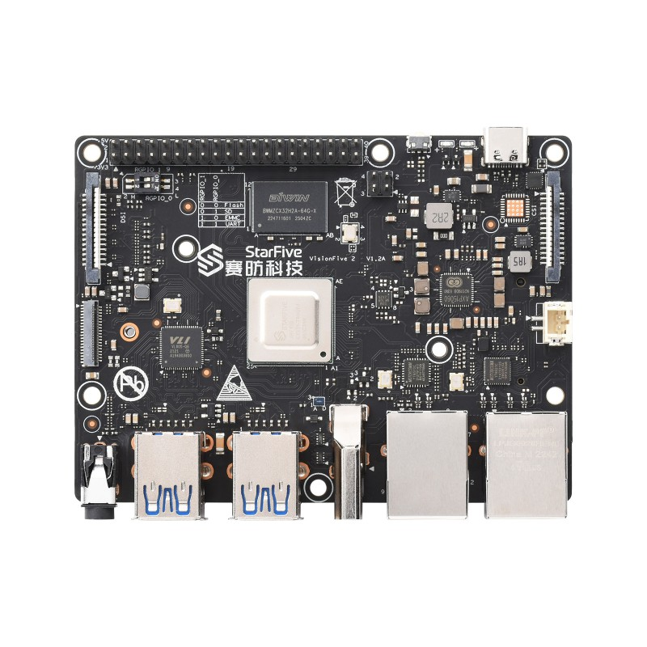

riscy

## Context
I was looking at my VisionFive 2 risc-v board 

and thought why don't I make a risc-v pwn?

## Writing the challenge
Initially I wanted to write a ROP based challenge. I know that risc-v uses a link register similar to ARM, so the goal would be to build an environment where you 

