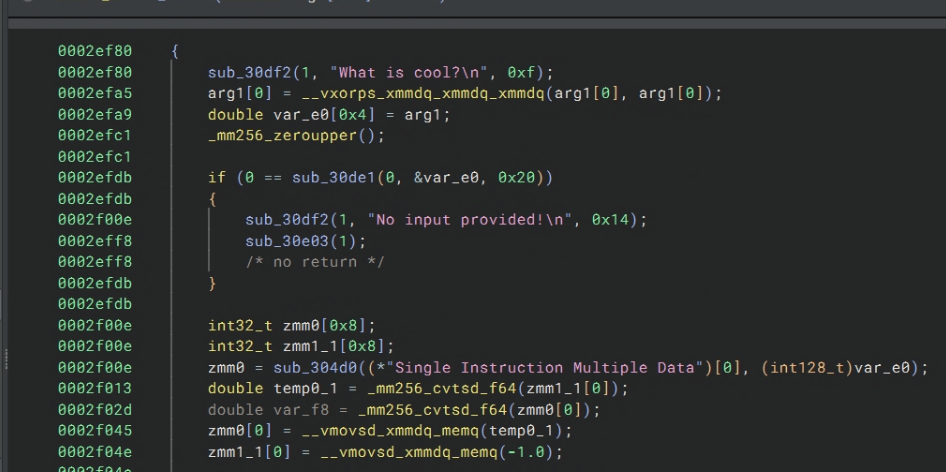
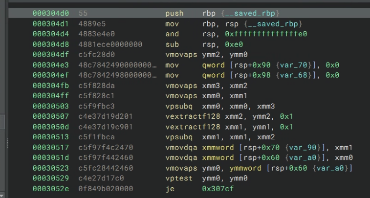
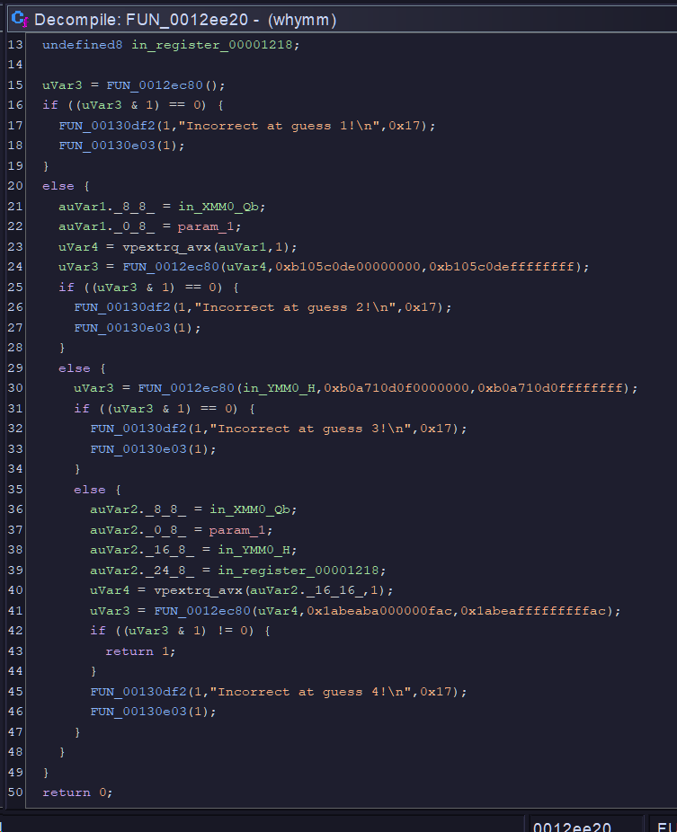
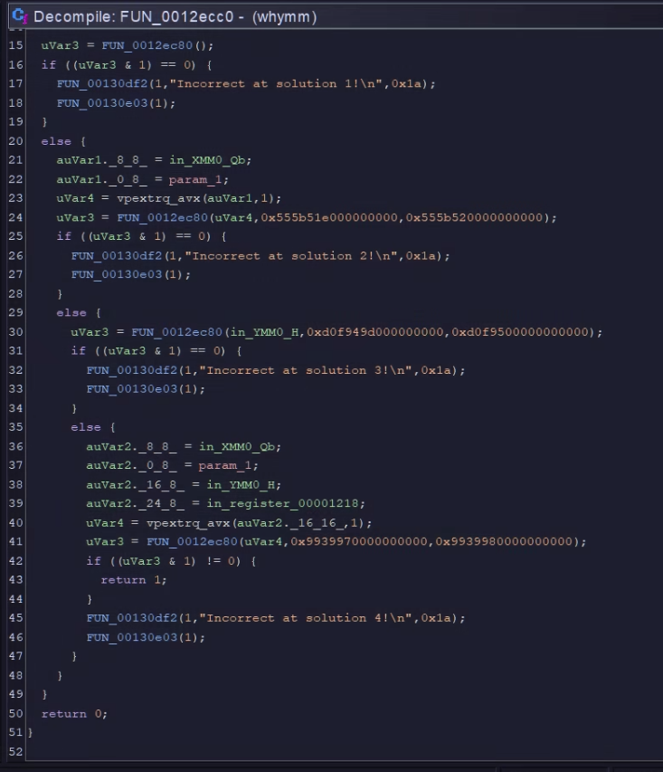
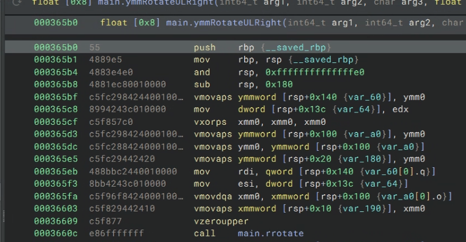
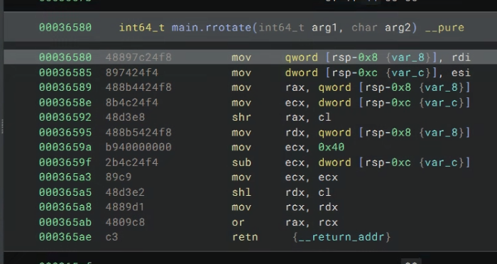

# Context
I learned about [zenbleed](https://lock.cmpxchg8b.com/zenbleed.html) from the [LiveUnderFlow Video](https://www.youtube.com/watch?v=9EY_9KtxyPg), since I have a Zen 2 CPU, I was very interested in how these registers are used in real programs as well as the vulnerability itself.

Then I saw another video by [tsoding](https://www.youtube.com/watch?v=Qzw1m7PweXs), which introduced me to [C3](https://c3-lang.org/) I played with the built-in vector type and realized that it automatically uses AVX instructions where calculations happen. So I decided that I wanted to make a challenge. Entirely based on SIMD instructions and packed values.

If you don't want to read the whole writeup, source code is available [here](https://github.com/leon332157/UMassCTF25/tree/main/vecwhymm)

## Initial idea

Throwing out some code on [Godbolt](https://godbolt.org/z/YasT6dM6o)

```c
import std::io;

fn int main()
{
uint128 v1 = -1;
uint128 v2 = -1;
uint128 v3 = v1 + v2;

uint[<16>] a = { 1,2,3,4,5,6,7,8,9,10,11,12,13,14,15,16 };
uint[<16>] b = { 16,15,14,13,12,11,10,9,8,7,6,5,4,3,2,1 };

uint[<16>] c = a * b;
if (a == (uint[<16>])0) {
    return a[0];
} else{
    return -1;
}
}
```

This generated some instructions like
`vpmulld`, `vxorps` which are probably 128bit MMX instructions. Proving to me that the vector type can in-fact generate AVX instructions. (LLVM MAGIC)

## Writing the challenge

I know that I wanted to do something with a simple `vxorps` where one end is the xor and the other end is xor'd flag. But I also didn't want players to hard bruteforce the entire xor pad for the flag.

Thus I struggled to come up with a way to hide the flag. Initially an idea was to use linear equations so that the flag is a solution for the equation y=mx+b using FMA operation built in to avx. However that required float and proven to be not feasible.

Then some idea came to me, what if I write a hash function and use the output of the hash to build the xorpad to hide the flag?

Thats what I did, I ~~vibe coded~~ a hash algorithm and adapted it to accept vectors. In addition, I wanted to use a 32 byte flag for a small message so the flag size became 32 bytes.

Click here if you'd like to jump to the hash function[]

### Let's define some types first

```c
alias XMMStr = char[<16>];
alias YMMStr = char[<32>];
alias YMMStrDiff = ichar[<32>];

alias YMMPackedL = long[<4>];
alias YMMPackedUL = ulong[<4>];
alias YMPackedUI = uint[<8>];
alias XMMPackedUI = uint[<4>]; 
```

These are essentially variations of packed values that fits exactly in either `XMM` or `YMM`.

## Reversing part 1

The main function is really long, however, there are some crucial parts.



Binary Ninja is surprisingly good at finding strings, let's look at this first function regardless.


I can see that this function takes in two parameters from `ymm0` and `ymm1`, then subtracts the lowest 16 bytes with the `vpsubq xmm0, xmm0, xmm3`, I assume the reason why compiler broke this down is due to me setting the feature flag to `avx`, where packed quadword subtraction in `ymm` is not supported until `avx2`. I would've written this with a packed subtraction of `ymm1 - ymm0`. Then this code checks if the returned value is 0, if yes then jmp. Basically this is a packed integer compare, and if they match, it will return 0.

I'm not going to go into how I return the incorrect byte position, but this function is essentially a `unsigned long[4]` compare.

```c
fn PackedXMMF ymmpulcmp(YMMPackedUL a, YMMPackedUL b) @noinline @callconv("veccall") {
    PackedXMMF retval;
    YMMPackedUL sub = b - a;
    if (sub != (YMMPackedUL)0) {
        YMMStrDiff diffStr = vConvPLtoYMMStrDiff(sub);
        for (uint i = 0; i < 32; i++) {
            if (diffStr[i] != 0x0) {
                retval.higher = (double)i;
                retval.lower = (double)(long)diffStr[i];
                return retval;
            }
        }
    }
    retval.higher = -1.0;
    retval.lower = 0.0;
    return retval;
}
```

## Reversing part 2
Looking a little further down main, we can see that the binary takes in another "guess", then calls a function on it, here's the function

This was my attempt at giving hints on what the inputs should be. Here's the source:

```c

const YMMPackedUL KEY_HINT_LOWER = {
    0xAc15c0D060000000,
    0xB105c0de00000000,
    0xb0a710d0f0000000,
    0x1abeaba000000fac
};

const YMMPackedUL KEY_HINT_UPPER = {
    0xAc15c0D06FFFFFFF,
    0xB105c0deffffffff,
    0xb0a710d0ffffffff,
    0x1abeafffffffffac
};

fn bool inRange(ulong x, ulong low, ulong high) @noinline {
    return (low < x && x < high);
}
fn bool checkGuess(YMMPackedUL guess) @noinline @callconv("veccall") {
    if (inRange(guess[0], KEY_HINT_LOWER[0], KEY_HINT_UPPER[0])) {
        if (inRange(guess[1], KEY_HINT_LOWER[1], KEY_HINT_UPPER[1])) {
            if (inRange(guess[2], KEY_HINT_LOWER[2], KEY_HINT_UPPER[2])) {
                if (inRange(guess[3], KEY_HINT_LOWER[3], KEY_HINT_UPPER[3])) {
                    return true;
                } else {
                    write_syscall(1, "Incorrect at guess 4!\n", 23);
                    exit_syscall(1);
                }
            } else {
                write_syscall(1, "Incorrect at guess 3!\n", 23);
                exit_syscall(1);
            }
            
        } else {
            write_syscall(1, "Incorrect at guess 2!\n", 23);
            exit_syscall(1);
        }
    } else {
        write_syscall(1, "Incorrect at guess 1!\n", 23);
        exit_syscall(1);
    }
    return false;
}
```

## Reversing part 3
Looking a little more into main, we can see that binary calls anther function with the input value, here I try to give you hints on what the hash should be, which we will get to later, but as you can see it is very wide, thus brutefocing the value would be infeasible in a short time.


```c
/*
const YMMPackedUL FLAG_XOR_BYTES ={ // flag is xor with these bytes
    0xe9d1320babe13369, 
    0x555b51ee3c59eb14,
    0xd0f949de8bcd6dbe,
    0x993997d56c58653e
};
*/

const YMMPackedUL FLAG_XOR_HINT_LOWER = {
    0xe9d1320000000000,
    0x555b51e000000000,
    0xd0f949d000000000,
    0x9939970000000000
};

const YMMPackedUL FLAG_XOR_HINT_UPPER = {
    0xe9d1330000000000,
    0x555b520000000000,
    0xd0f9500000000000,
    0x9939980000000000
};

fn bool checkSolution(YMMPackedUL inp) @noinline @callconv("veccall") {
    if (inRange(inp[0], FLAG_XOR_HINT_LOWER[0], FLAG_XOR_HINT_UPPER[0])) {
        if (inRange(inp[1], FLAG_XOR_HINT_LOWER[1], FLAG_XOR_HINT_UPPER[1])) {
            if (inRange(inp[2], FLAG_XOR_HINT_LOWER[2], FLAG_XOR_HINT_UPPER[2])) {
                if (inRange(inp[3], FLAG_XOR_HINT_LOWER[3], FLAG_XOR_HINT_UPPER[3])) {
                    return true;
                } else {
                    write_syscall(1, "Incorrect at solution 4!\n", 26);
                    exit_syscall(1);
                }
            } else {
                write_syscall(1, "Incorrect at solution 3!\n", 26);
                exit_syscall(1);
            }
            
        } else {
            write_syscall(1, "Incorrect at solution 2!\n", 26);
            exit_syscall(1);
        }
    } else {
        write_syscall(1, "Incorrect at solution 1!\n", 26);
        exit_syscall(1);
    }
    return false;
}
```
## The Hash Function

This sequence contains multiply and rotate, then multiply with B_VAL, which is `Single Instruction Multiple Data` as ascii bytes broken down into 4 unsigned longs, where M_VAL is `Multiple Data Single Instruction`. These are left over values from when I did `y=mx+b` where `m` and `b` are given, you just solve for `y` when guessing `x`

I needed to convert the rotation to scalar rotation since there are no vector packed rotation instructions, and simply using shift and or did not work as intended.

Assuming you reached this point, you may see the assembly as such:


This sequence will multiply the packed unsigned longs in `ymm0`, the first chunks from what I can tell breaks down the packed values into smaller `xmm` registers, then it uses the constant in `xmm2` to `VectorMultiplyDoubleQuadword`, this will return an unsigned 128bit value in `xmm4`, which is then added to some mask in `xmm5`. I believe there are some LLVM optimizations here that I don't fully understand, but it is cool!

Now the rotation function:




The first part is mostly used to extract the first value needed for the rotate function. Then it's just a normal scalar rotate.

```c
fn ulong lrotate(ulong value, int shift) {
    return (value << shift) | (value >> (64 - shift));
}

fn ulong rrotate(ulong value, int shift) {
    return (value >> shift) | (value << (64 - shift));
}

fn YMMPackedUL ymmRotateULeft(YMMPackedUL a, int shift)  @noinline @callconv("veccall") {
    YMMPackedUL ret;
    ret[0] = lrotate(a[0], shift);
    ret[1] = lrotate(a[1], shift);
    ret[2] = lrotate(a[2], shift);
    ret[3] = lrotate(a[3], shift);
    return ret;
}

fn YMMPackedUL ymmRotateULRight(YMMPackedUL a, int shift) @noinline @callconv("veccall") {
    YMMPackedUL ret;
    ret[0] = rrotate(a[0], shift);
    ret[1] = rrotate(a[1], shift);
    ret[2] = rrotate(a[2], shift);
    ret[3] = rrotate(a[3], shift);
    return ret;
}

fn YMMPackedUL ymmHash(YMMPackedUL i) @noinline @callconv("veccall") {
    const ulong HASH = 0xcbf29ce484222325;
    const ulong PRIME1 = 11400714785074694791UL;
    const ulong PRIME2 = 14029467366897019727UL;
    const ulong PRIME3 = 1609587929392839161UL;
    const ulong PRIME4 = 9650029242287828579UL;
    YMMPackedUL ret;
    ret = i ^ HASH;
    ret *= PRIME1;
    ret ^= ymmRotateULRight(ret, 33);
    ret *= PRIME2;
    ret ^= ymmRotateULRight(ret, 29);
    ret *= PRIME3;
    ret ^= ymmRotateULRight(ret, 31);
    ret *= PRIME4;
    ret ^= ymmRotateULRight(ret, 23);
    ret *= B_VAL_FMA_YMM;
    ret ^= ymmRotateULRight(ret, 37);
    ret *= M_VAL_FMA_YMM;
    ret ^= ymmRotateULRight(ret, 41);
    return ret;
}
```

I have tested the hash and it seems to do pretty well in terms of collision.

## The flag builder

Assuming that you have construed the hash function correctly, you can rebuild it and bruteforce all the combinations given in the hint, between the lower and upper bounds.

According to my flag builder written in C, it would take about 5 minutes max to bruteforce the range of hashes that are in the range.

Flag builder:

```c
#include <stdio.h>
#include <string.h>
#include <time.h>

const char flag[] = "i<3s1md!h4v_u_h34rd_0f_z3nb133d?";
unsigned long lrotate(unsigned long value, int shift) {
    return (value << shift) | (value >> (64 - shift));
}

unsigned long rrotate(unsigned long value, int shift) {
    return (value >> shift) | (value << (64 - shift));
}

const unsigned long M_VAL_FMA_YMM[] = {
    // SIMD IN YMMPackedUL BE
    0x53696e676c652049,
    0x6e73747275637469,
    0x6f6e204d756c7469,
    0x706c652044617406,
};

const unsigned long B_VAL_FMA_YMM[] = {
    0x4d756c7469706c65,
    0x2044617461205369,
    0x6e676c6520496e73,
    0x7472756374696f6e,
};

unsigned long ymmHash(unsigned long i,char idx) {
    unsigned long hash = 0xcbf29ce484222325;
    const unsigned long PRIME1 = 11400714785074694791UL;
    const unsigned long PRIME2 = 14029467366897019727UL;
    const unsigned long PRIME3 = 1609587929392839161UL;
    const unsigned long PRIME4 = 9650029242287828579UL;

    hash = i ^ hash;
    hash *= PRIME1;
    hash ^= rrotate(hash, 33);
    hash *= PRIME2;
    hash ^= rrotate(hash, 29);
    hash *= PRIME3;
    hash ^= rrotate(hash, 31);
    hash *= PRIME4;
    hash ^= rrotate(hash, 23);
    hash *= B_VAL_FMA_YMM[idx];
    hash ^= rrotate(hash, 37);
    hash *= M_VAL_FMA_YMM[idx];
    hash ^= rrotate(hash, 41);
    return hash;
}

int main() {
    unsigned long inputs[] = {
        0xAc15c0D068badD11,
        0xB105c0deca11ab1e,
        0xb0a710d0f0ddc0de,
        0x1abeabad00beefac,
    };

    unsigned long hashs[4] = { 0 };

    for (int i = 0; i < 4; i++) {
        hashs[i] = ymmHash(inputs[i],i);
    }
    for (int i = 0; i < 4; i++) {
        printf("Hash %d: %lx\n", i, hashs[i]);
    }

    time_t now = time(NULL);
    unsigned long result = 0;
    int collision = 0;
    for (unsigned long i = 0xAc15c0D060000000; i <= 0xAc15c0D06FFFFFFF; i++) { // 0xAc15c0D068badD11U;i++) {
        result = ymmHash(i,0);
        if (result == hashs[0]) {
            collision++;
            //break;
        }
    }
    printf("Collision: %d\n", collision);
    printf("Time: %lu\n", time(NULL) - now);
    collision = 0;
    now = time(NULL);
    for (unsigned long i = 0xB105c0de00000000U; i <= 0xB105c0deffffffffU; i++) {
        result = ymmHash(i,1);
        if (result == hashs[1]) {
            collision++;
            //break;
        }
    }
    printf("Collision: %d\n", collision);
    printf("Time: %lu\n", time(NULL) - now);
    collision = 0;
    now = time(NULL);
    for (unsigned long i = 0xb0a710d0f0000000U; i <= 0xb0a710d0ffffffffU; i++) {
        result = ymmHash(i,2);
        if (result == hashs[2]) {
            collision++;
            //break;
        }
    }
    printf("Collision: %d\n", collision);
    printf("Time: %lu\n", time(NULL) - now);
    collision = 0;
    now = time(NULL);
    for (unsigned long i = 0x1abeaba000000facU; i <= 0x1abeabafffffffacU; i++) {
        result = ymmHash(i,3);
        if (result == hashs[3]) {
            collision++;
            //break;
        }
    }
    printf("Collision: %d\n", collision);
    printf("Time: %lu\n", time(NULL) - now);

    unsigned long results[4] = { 0 };
    unsigned long xorFlagLong[4] = { 0 };
    unsigned char xorFlag[33] = { 0x0 };
    memcpy(xorFlag, flag, sizeof(flag));
    memcpy(xorFlagLong, flag, 32);
    for (int i = 0; i < 4; i++) {
        xorFlagLong[i] ^= hashs[i];
    }
    for (int i = 0; i < 4; i++) {
        printf("XOR Flag Long %d: %lx\n", i, xorFlagLong[i]);
    }
    xorFlag[0] ^= (unsigned char)((results[0] >> 56) & 0xFF);
    xorFlag[1] ^= (unsigned char)((results[0] >> 48) & 0xFF);
    xorFlag[2] ^= (unsigned char)((results[0] >> 40) & 0xFF);
    xorFlag[3] ^= (unsigned char)((results[0] >> 32) & 0xFF);
    xorFlag[4] ^= (unsigned char)((results[0] >> 24) & 0xFF);
    xorFlag[5] ^= (unsigned char)((results[0] >> 16) & 0xFF);
    xorFlag[6] ^= (unsigned char)((results[0] >> 8) & 0xFF);
    xorFlag[7] ^= (unsigned char)(results[0] & 0xFF);
    xorFlag[8] ^= (unsigned char)((results[1] >> 56) & 0xFF);
    xorFlag[9] ^= (unsigned char)((results[1] >> 48) & 0xFF);
    xorFlag[10] ^= (unsigned char)((results[1] >> 40) & 0xFF);
    xorFlag[11] ^= (unsigned char)((results[1] >> 32) & 0xFF);
    xorFlag[12] ^= (unsigned char)((results[1] >> 24) & 0xFF);
    xorFlag[13] ^= (unsigned char)((results[1] >> 16) & 0xFF);
    xorFlag[14] ^= (unsigned char)((results[1] >> 8) & 0xFF);
    xorFlag[15] ^= (unsigned char)(results[1] & 0xFF);
    xorFlag[16] ^= (unsigned char)((results[2] >> 56) & 0xFF);
    xorFlag[17] ^= (unsigned char)((results[2] >> 48) & 0xFF);
    xorFlag[18] ^= (unsigned char)((results[2] >> 40) & 0xFF);
    xorFlag[19] ^= (unsigned char)((results[2] >> 32) & 0xFF);
    xorFlag[20] ^= (unsigned char)((results[2] >> 24) & 0xFF);
    xorFlag[21] ^= (unsigned char)((results[2] >> 16) & 0xFF);
    xorFlag[22] ^= (unsigned char)((results[2] >> 8) & 0xFF);
    xorFlag[23] ^= (unsigned char)(results[2] & 0xFF);
    xorFlag[24] ^= (unsigned char)((results[3] >> 56) & 0xFF);
    xorFlag[25] ^= (unsigned char)((results[3] >> 48) & 0xFF);
    xorFlag[26] ^= (unsigned char)((results[3] >> 40) & 0xFF);
    xorFlag[27] ^= (unsigned char)((results[3] >> 32) & 0xFF);
    xorFlag[28] ^= (unsigned char)((results[3] >> 24) & 0xFF);
    xorFlag[29] ^= (unsigned char)((results[3] >> 16) & 0xFF);
    xorFlag[30] ^= (unsigned char)((results[3] >> 8) & 0xFF);
    xorFlag[31] ^= (unsigned char)(results[3] & 0xFF);
    printf("XOR'd Flag: ");
    for (int i = 0; i < 32; i++) {
        printf("%02x", xorFlag[i]);
    }
    return 0;
}
```

# Final Thoughts

Although I was able to come up with the solve, I realized that the hash wasn't good enough and caused collisions especially within the given range of hash outputs. In addition, I realized how guessy this challenge has became with compiler optimizing the range check function into a packed XOR, especially with author bias, I feared that the challenge has turned a lot more difficult than I thought and released a easier binary, which did seem to get a few more solves.

Thank you for playing and reading. I hope you enjoyed UMass CTF.